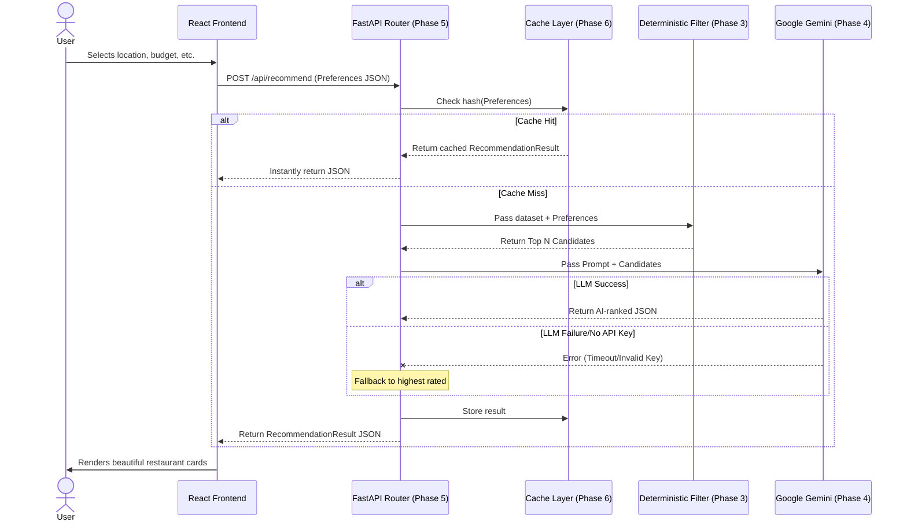

# System Flow & Architecture Overview

This document provides a comprehensive, step-by-step breakdown of how the AI-Powered Restaurant Recommendation System processes a user query from start to finish. 

The system relies on a modern decoupled architecture: a **React + Vite Frontend** and a **FastAPI + Python Backend**.

---

## 1. High-Level Sequence Flow

The following diagram illustrates the lifecycle of a typical user request:

---

## 2. Detailed Phase-by-Phase Breakdown

Here is exactly what happens under the hood during the application's lifecycle.

### Stage A: Application Startup
When the FastAPI backend is started (e.g., via `uvicorn`), the **Lifespan Context Manager** kicks in.
1. **Phase 1 (Data Ingestion)**: The server automatically connects to the Hugging Face API and downloads the `ManikaSaini/zomato-restaurant-recommendation` dataset.
2. **Normalization & Deduplication**: The raw CSV data is normalized (strings trimmed, arrays built) and duplicated restaurant listings (based on Name + Location) are discarded.
3. **Memory Cache**: The resulting ~12,000 clean `Restaurant` objects are loaded directly into the server's memory (`app.state.dataset_cache`). This makes future operations incredibly fast since disk I/O and network downloads are avoided.

### Stage B: The User Request
1. **Phase 5 (Presentation)**: The user visits the React frontend. They interact with a glassmorphism-styled form to select their criteria:
   - **Location**: e.g., "Indiranagar"
   - **Budget Band**: Low, Medium, or High
   - **Cuisines**: e.g., "Cafe, Desserts"
   - **Minimum Rating**: e.g., 4.2
2. The React app packages this into a JSON payload and makes an HTTP `POST` request to the backend's `/api/recommend` endpoint.

### Stage C: Observability and Caching
1. **Phase 6 (Middleware)**: The request passes through the `LoggingMiddleware`, which starts a high-resolution timer.
2. **Phase 6 (Cache Layer)**: The `cache.py` module generates an MD5 hash of the incoming JSON payload. 
   - If that hash exists in the cache dictionary, it means someone has already searched for these exact parameters! The system instantly returns the cached result, skipping the rest of the steps entirely.

### Stage D: Deterministic Retrieval
Assuming a cache miss, the system must narrow down the 12,000+ dataset rows to a manageable chunk for the AI.
1. **Phase 3 (Filtering)**: The `retrieve_candidates()` function iterates over the in-memory dataset.
2. It strictly filters out any restaurants that do not match the requested location, budget, minimum rating, and cuisines.
3. It caps the results (e.g., maximum 25 candidates) to prevent overloading the LLM's context window.

### Stage E: The AI Engine
1. **Phase 4 (Prompt Assembly)**: The `build_user_prompt()` function dynamically creates a text prompt. It explains the user's constraints and injects a heavily constrained JSON serialization of the 25 candidate restaurants.
2. **Phase 4 (LLM Call)**: The prompt, along with a strict `SYSTEM_PROMPT` instructing the AI to output Pydantic-compliant JSON, is sent to the Google Gemini API (`gemini-2.5-flash`).
3. **The Fallback**: If the Gemini API fails (due to a missing API key, rate limits, or network timeout), the engine catches the exception and degrades gracefully. It sorts the 25 candidates by their rating and returns the top 3 with a generic "Fallback recommendation" note.

### Stage F: Delivery
1. The AI's ranked output (or the fallback output) is stored in the **Phase 6 Cache**.
2. The backend responds to the frontend with the JSON payload.
3. The frontend parses the response and uses CSS keyframes to dynamically slide the restaurant recommendation cards onto the screen.
